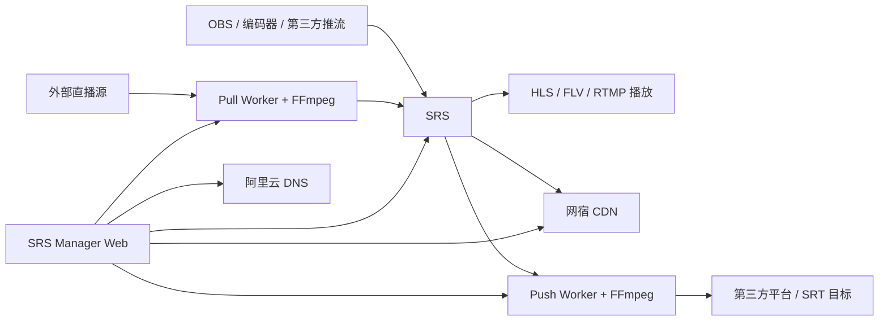

<div align="center">

# SRS Manager · 直播运维控制台

**面向 SRS 的推流、拉流、监看、分发与直播值守控制台**

`v0.4.0` · `React 19` · `Node.js 24` · `SQLite WAL` · `FFmpeg Media Workers`

> 当前 MVP 目标很明确：**能推进去、能拉进来、能看见真实状态、能安全控制。**

</div>

---

## 当前版本：v0.4.0 · 四向链路控制

v0.4.0 在 v0.3.0 推拉流 MVP 基础上继续补齐输出方向控制：现在四类基础链路已经都进入统一工作台与控制模型。

- **第三方推给我（IN-PUSH）**：创建直播流 → 获取 RTMP 推流地址 → OBS/编码器推入 SRS → 工作台观察真实 Publisher；
- **我拉第三方（IN-PULL）**：创建外部源 → 绑定 Managed Pull → Pull Worker + FFmpeg 拉入 SRS → 支持主备故障切换与人工安全切源；
- **我推第三方（OUT-PUSH）**：Push Worker 从当前 SRS 流取流 → 主动推送 RTMP/RTMPS/SRT 目标 → 可真正 Start / Stop / Retry；
- **第三方拉我（OUT-PULL）**：可分别控制 Origin 端点、新连接准入、Access Grant 与当前播放会话。

完整版本记录见 [CHANGELOG.md](./CHANGELOG.md)，产品内也可直接打开「版本更新」页面查看。

## MVP 快速开始

### 1. 推流到 SRS

进入「直播流」，创建或选择一条流，复制系统生成的 RTMP 推流地址：

```text
rtmp://<SRS_HOST>:1935/live/<STREAM_NAME>
```

在 OBS、编码器或其他推流设备中填写该地址。推流开始后，SRS Manager 会通过 SRS API 与 Hooks 观察真实 Publisher、码率、观众和在线状态。

### 2. 从外部源拉流到 SRS

进入「转发路由」创建外部来源，可使用 RTMP、RTMPS、SRT、RTSP、HTTP 或 HTTPS 地址；随后进入对应的「单流工作台」绑定 Managed Pull。

执行链路：

```text
外部直播源
   ↓
Pull Worker / FFmpeg
   ↓
SRS /live/<stream>
   ↓
播放、CDN、后续分发
```

同一 PullTask 可以配置多个候选源。主源连续失败达到门槛后，Worker 会按优先级切换到备用源；人工切源采用受控 Operation，按「停止旧源 → 确认 Publisher 消失 → 启动目标源 → 验证新 Publisher」执行。

## 产品能力

| 能力域 | 当前能力 |
|---|---|
| 运营中心 | 系统状态、正在直播、码率/观众、事件时间线、MVP 推流/拉流快捷入口 |
| 直播流 | 流管理、推流地址、拉流地址、二维码、预览、真实在线状态 |
| 单流工作台 | 输入/输出聚合、Publisher/Viewer 状态、Managed Pull、Managed Push、OUT-PULL 授权、CDN、分发、活动记录 |
| Managed Pull | 独立 Pull Worker、FFmpeg 拉流、重试退避、Worker Lease、主备源、人工安全切源 |
| Managed Push | 独立 Push Worker、RTMP/RTMPS/SRT 外推、WAITING_INPUT、重试退避、Worker Lease、真启动/真停止 |
| OUT-PULL | Origin 端点、新连接准入、Access Grant、授权吊销、当前会话断开 |
| CDN | 网宿 CDN 频道管理、状态查询、启停、禁播/复播 |
| DNS | 阿里云 DNS 与域名记录管理 |
| 来源与外推 | 外部输入源、Managed OUT-PUSH、旧 SRS Dynamic Forward 兼容 |
| 鉴权 | 推流/拉流密钥、时间戳防盗链、密钥轮换 |
| 转码 | 转码模板、纯音频模板、SRS 配置生成 |
| 监看 | 单流状态、HLS 预览、观众趋势 |
| 版本更新 | 产品内版本时间线、当前版本亮点、仓库中文 CHANGELOG |

## 架构概览



### 运行组件

- **Web**：Node.js 24 + Express，提供 API、认证、页面与运维控制；
- **前端**：React 19 + Vite + Tailwind CSS v4；
- **数据库**：SQLite WAL；
- **Pull Worker**：独立容器，持有唯一 Worker Lease，负责 Managed Pull 生命周期；
- **Push Worker**：独立容器，持有独立 Lease，负责 Managed OUT-PUSH 生命周期；
- **媒体执行**：FFmpeg，默认优先直拷贝/封装转换，不自动偷偷转码；
- **状态事实源**：SRS streams / clients / hooks 与 Worker Runtime 共同组成真实运行证据。

## 部署

### 前置条件

- Docker 与 Docker Compose；
- 已运行的 SRS；
- RTMP 端口默认 `1935`；
- SRS HTTP API 端口默认 `1985`；
- 如使用 CDN / DNS 功能，需要对应的网宿和阿里云凭据。

### 1. 推荐：一键部署

首次部署直接执行：

```bash
ADMIN_PASSWORD='请设置一个强密码' ./scripts/deploy.sh
```

如果不传 `ADMIN_PASSWORD`，脚本会生成一次性随机管理员密码并只在本次终端输出。脚本会自动：

- 创建权限为 `0600` 的 `.env`；
- 生成 `JWT_SECRET`；
- 使用项目镜像内的 `bcryptjs` 生成管理员密码哈希，无需宿主机安装 Node/npm；
- 构建并启动 Web、Pull Worker、Push Worker；
- 等待 `/api/health` 健康检查通过；
- 启动失败时打印最近 Compose 日志。

需要手工部署时，可复制 `.env.example` 并填写 SRS 地址、Token、管理员哈希等配置。

### 2. 配置 SRS Hooks

将 `srs-hooks-config.conf` 中的 `http_hooks` 合并进 SRS 配置，并确保 SRS 可以访问 Manager API。

> v0.4 起 OUT-PUSH 默认由 Push Worker 管理，**不需要开启 SRS Dynamic Forward**。配置文件中的 `forward` 段仅供仍保留 `srs_dynamic` 历史任务的兼容场景。

### 3. 启动 / 升级

推荐始终使用：

```bash
./scripts/deploy.sh
```

也可以在已经准备好 `.env` 的情况下直接执行：

```bash
docker compose up -d --build
```

默认访问地址：

```text
http://<服务器IP>:3001
```

### 4. 健康检查与控制面验收

```bash
curl http://localhost:3001/api/health
```

正常情况下返回：

```json
{"status":"ok","uptime":123}
```

然后执行当前 API 契约的控制面冒烟测试：

```bash
ADMIN_PASSWORD='管理员密码' node scripts/e2e-test.js
```

该脚本会自动创建并清理临时测试数据，验证登录、建流、密钥脱敏、IN-PULL 绑定、OUT-PUSH 配置、Workspace、OUT-PULL Grant 授权/吊销。它不要求真实媒体源，因此适合作为每次部署后的第一道验收。

真实 RTMP/SRT 媒体链路再按部署现场执行推流、拉流、故障切换和外推验收。

## CI 使用策略

为了节省 GitHub Actions 用量，CI 从 v0.3.0 起按变更范围执行：

- **后端快速检查**：只有 `backend/**` 变化时运行；
- **前端快速检查**：只有 `frontend/**` 变化时运行；
- **容器发布检查**：普通业务代码提交不自动构建镜像，仅 Docker / Compose / 依赖清单变化、版本标签或人工触发时运行；
- 同一分支有新提交时，旧的同类 CI 自动取消，避免重复消耗；
- 纯文档与 CHANGELOG 更新不触发构建类 CI。

发布前仍建议执行一次「容器发布检查」，确保 Web 镜像、媒体 Worker 镜像、Compose、Push Worker 入口与 FFmpeg 运行时完整通过。

## 文档导航

- [产品与工作流设计](./docs/product/README.md)
- [整改阶段状态](./docs/product/REDESIGN-STATUS.md)
- [流向与控制模型](./docs/product/STREAM-FLOW-AND-CONTROL-MODEL.md)
- [单流工作台设计](./docs/product/STREAM-WORKSPACE-V0.1.md)
- [拉流运行时与四向链路](./docs/product/PULL-RUNTIME-AND-FLOW-LINKAGE-V0.1.md)
- [主备拉流与故障切换](./docs/product/PULL-FAILOVER-V0.1.md)
- [主动外推与第三方拉流控制](./docs/product/OUT-PUSH-OUT-PULL-V0.1.md)
- [主动外推与拉流授权控制](./docs/product/OUT-PUSH-OUT-PULL-V0.1.md)
- [界面与体验整改基线](./docs/product/UI-REDESIGN-V0.1.md)
- [版本更新记录](./CHANGELOG.md)

## 项目结构

```text
srs-manager/
├── frontend/                 # React 运营控制台
├── backend/                  # Express API 与业务服务
│   ├── pull-worker.js        # Managed Pull 独立 Worker
│   ├── push-worker.js        # Managed OUT-PUSH 独立 Worker
│   ├── routes/               # API 路由
│   ├── services/             # 领域服务 / Operation / 状态聚合
│   └── tests/                # 后端回归测试
├── docs/product/             # 中文产品、工作流和架构设计
├── scripts/                  # 部署与验证脚本
├── Dockerfile                # Web / 媒体 Worker 多阶段镜像
├── docker-compose.yml        # Web + Pull Worker + Push Worker 编排
├── srs-hooks-config.conf     # SRS Hooks 配置片段
└── CHANGELOG.md              # 中文版本更新记录
```

## 安全基线

- Access Token + Refresh Token + bcrypt 登录认证；
- 登录失败锁定与请求限流；
- 外部 Source URL 在普通 API 与 Worker 日志中默认脱敏；
- Pull Worker 与 Push Worker 分别使用 Lease 保证单执行者；
- Access Grant 数据库只保存 token 哈希，完整 token 仅签发时返回一次；
- OUT-PULL 的授权策略只对 SRS Origin 负责，不冒充第三方 CDN 鉴权；
- 危险操作必须区分配置状态、期望状态、运行状态和真实观测状态；
- 人工安全切源不会直接改一个字段后宣称成功，而是经过完整 Operation 状态机验证。

## 开发

后端：

```bash
cd backend
npm ci
npm test
node server.js
```

前端：

```bash
cd frontend
npm ci
npm run build
npm run dev
```

---

> 当前优先级：完成 **v0.4.0 四向链路控制** 的真实媒体验收，再进入 Live Event、Preflight、告警、Reconciler、Audit、Runbook 与自动化。
