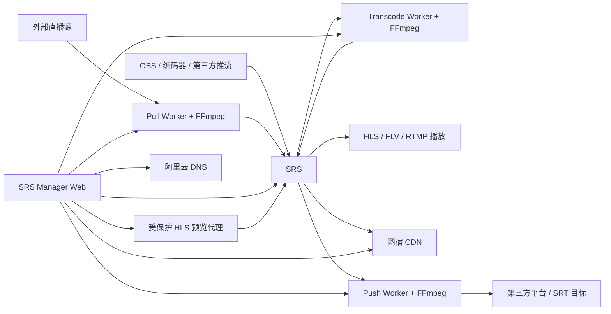

<div align="center">

# SRS Manager · 直播运维控制台

**面向 SRS 的推流、拉流、监看、分发与直播值守控制台**

`v0.6.0` · `React 19` · `Node.js 24` · `SQLite WAL` · `FFmpeg Media Workers`

> 当前目标：**一条直播业务在一个工作台完成采集、处理、转码、分发、访问控制与实时监看。**

</div>

---

## 当前版本：v0.6.0 · Workspace V3 直播运维控制台

v0.6.0 完成从“技术模块管理后台”到“直播运维控制台”的 V3 收敛。直播间不再围绕 Pull / Forward / Transcode 页面组织，而是围绕 **Room → Session → Sources → Program → Renditions → Outputs** 的真实值守流程组织。

- **16:9 播控工作面**：Input Rack / Program PGM-PVW / Output Rack / Signal Route / Operations Dock 固定空间映射；
- **可信监看**：Program 默认 HTTP-FLV 低延迟安全预览，HLS fallback；Source PVW 按需建立，绝不冒充当前 Program；
- **统一 Output**：PUSH / SERVE / RECORD 共用场景模式、专业模式、Capability Explain、Operation 与 Evidence；
- **共享 Rendition**：相同处理规格只编码一次，可同时服务多个外推与录制 Consumer；
- **安全录制**：Record Worker 使用可恢复 TS 分段，正常停止后 MP4 finalize，异常中断保留 RECOVERABLE 产物；
- **Session / Run Plan / Preflight**：Required / Optional、幂等开播、局部成功和本场意图与真实 Runtime 分离；
- **Incident / Closing**：影响链、ACK ≠ RECOVERED、自动恢复时间线与安全收播编排；
- **兼容迁移**：v0.5.1 SQLite additive migration 保留旧表/旧列/旧数据，旧 backend 已验证可读取升级后数据库。

完整版本记录见 [CHANGELOG.md](./CHANGELOG.md)，产品内也可直接打开「版本更新」页面查看。

## 快速开始

### 1. 推流到 SRS

进入「直播流」，创建或选择一条流，复制系统生成的 RTMP 推流地址：

```text
rtmp://<SRS_HOST>:1935/live/<STREAM_NAME>
```

在 OBS、编码器或其他推流设备中填写该地址。推流开始后，SRS Manager 会通过 SRS API 与 Hooks 观察真实 Publisher、码率、观众和在线状态。

### 2. 从外部源拉流到 SRS

进入「直播工作台」选择目标流，在“主动拉流”区域直接登记 RTMP、RTMPS、SRT、RTSP、HTTP 或 HTTPS 来源，并绑定 / 启动 Managed Pull。正常值守不再需要跳到独立「转发路由」。

执行链路：

```text
外部直播源
   ↓
Pull Worker / FFmpeg
   ↓
SRS /live/<stream>
   ↓
播放、CDN、后续分发
```

同一 PullTask 可以配置多个候选源。主源连续失败达到门槛后，Worker 会按优先级切换到备用源；人工切源采用受控 Operation，按「停止旧源 → 确认 Publisher 消失 → 启动目标源 → 验证新 Publisher」执行。

## 产品能力

| 能力域 | 当前能力 |
|---|---|
| 运营中心 | 系统状态、正在直播、码率/观众、事件时间线、MVP 推流/拉流快捷入口 |
| 直播工作台 | 16:9 Input / Program / Output / Signal Route / Operations Dock；PREP / ON AIR / INCIDENT / CLOSING 固定空间值守 |
| 单流运行台 | Publisher/Viewer、码率/时长/观众、Managed Pull/Push、多转码、OUT-PULL、CDN、分发、活动记录 |
| Managed Pull | 独立 Pull Worker、FFmpeg 拉流、重试退避、Worker Lease、主备源、人工安全切源 |
| Managed Push | 独立 Push Worker、RTMP/RTMPS/SRT 外推、WAITING_INPUT、重试退避、Worker Lease、真启动/真停止 |
| OUT-PULL | RTMP/HTTP-FLV 等 on_play 路径的 Hook 准入、Access Grant、吊销与当前会话断开；直连 HLS 单独防护 |
| CDN | 网宿 CDN 频道管理、状态查询、启停、禁播/复播 |
| DNS | 阿里云 DNS 与域名记录管理 |
| 来源与外推 | 外部输入源、Managed OUT-PUSH、旧 SRS Dynamic Forward 兼容 |
| 鉴权 | 推流/拉流密钥、时间戳防盗链、密钥轮换 |
| 媒体规格 / Rendition | Canonical shared Rendition；H.264/H.265/音频规格；多个 Output/Recording 复用同一处理管线 |
| 监看 | HTTP-FLV-first 安全 Program Preview + HLS fallback、按需 PGM/PVW、L/R RMS dBFS、Evidence freshness |
| Session / Incident / Record | Run Plan / Preflight、Incident 影响链、Closing、Record Worker 安全分段与 MP4 Finalize |
| 版本更新 | 产品内版本时间线、当前版本亮点、仓库中文 CHANGELOG |

## 架构概览



### 运行组件

- **Web**：Node.js 24 + Express，提供 API、认证、页面与运维控制；
- **前端**：React 19 + Vite + Tailwind CSS v4；
- **数据库**：SQLite WAL；
- **Pull Worker**：独立容器，持有唯一 Worker Lease，负责 Managed Pull 生命周期；
- **Push Worker**：独立容器，持有独立 Lease，负责 Managed OUT-PUSH 生命周期；
- **Transcode Worker**：独立执行器，一条源流一个 FFmpeg Pipeline，负责多派生转码与恢复；
- **Record Worker**：独立执行器，负责安全 TS 分段、MP4 Finalize、异常可恢复资产与磁盘预算；
- **Preview Proxy**：Web 内的同源受保护 HTTP-FLV/HLS 代理，只为已登录值班员签发短时单流预览访问；
- **媒体执行**：FFmpeg；拉流/外推默认不偷偷转码，只有明确挂载转码模板时才重新编码；
- **状态事实源**：SRS streams / clients / hooks 与 Worker Runtime 共同组成真实运行证据。

## 部署

### 前置条件

- Docker 与 Docker Compose；
- 已运行的 SRS；
- RTMP 端口默认 `1935`；
- SRS HTTP API 端口默认 `1985`；
- 如使用 CDN / DNS 功能，需要对应的网宿和阿里云凭据。

### 1. 推荐：一键部署

首次部署直接执行：

```bash
ADMIN_PASSWORD='请设置一个强密码' ./scripts/deploy.sh
```

如果不传 `ADMIN_PASSWORD`，脚本会生成一次性随机管理员密码并只在本次终端输出。脚本会自动：

- 创建权限为 `0600` 的 `.env`；
- 生成 `JWT_SECRET`；
- 使用项目镜像内的 `bcryptjs` 生成管理员密码哈希，无需宿主机安装 Node/npm；
- 构建并启动 Web、Pull Worker、Push Worker、Transcode Worker、Record Worker；
- 等待 `/api/health` 健康检查通过；
- 启动失败时打印最近 Compose 日志。

需要手工部署时，可复制 `.env.example` 并填写 SRS 地址、Token、管理员哈希等配置。

### 2. 配置 SRS Hooks

将 `srs-hooks-config.conf` 中的 `http_hooks` 合并进 SRS 配置，并确保 SRS 可以访问 Manager API。

> v0.4 起 OUT-PUSH 默认由 Push Worker 管理，**不需要开启 SRS Dynamic Forward**。配置文件中的 `forward` 段仅供仍保留 `srs_dynamic` 历史任务的兼容场景。

### 3. 启动 / 升级

推荐始终使用：

```bash
./scripts/deploy.sh
```

也可以在已经准备好 `.env` 的情况下直接执行：

```bash
docker compose up -d --build
```

现有 `live` 生产节点如果采用 systemd 直跑 Node，可先把 release 候选同步到独立 staging 目录，再执行可回退升级脚本：

```bash
sudo ./scripts/deploy-systemd-release.sh /tmp/srs-manager-release /home/ubuntu/srs-manager
```

该脚本会在停服务前备份当前代码与 SQLite，一直保留 `.env`、`data/` 和既有 backend dependencies；安装 Record Worker unit、迁移数据库并完成健康检查。如果升级失败，会自动恢复旧代码和升级前的 systemd 单元状态。

默认访问地址：

```text
http://<服务器IP>:3001
```

### 4. 健康检查与控制面验收

```bash
curl http://localhost:3001/api/health
```

正常情况下返回：

```json
{"status":"ok","uptime":123}
```

然后执行当前 API 契约的控制面冒烟测试：

```bash
ADMIN_PASSWORD='管理员密码' node scripts/e2e-test.js
```

该脚本会自动创建并清理临时测试数据，验证登录、建流、密钥脱敏、IN-PULL 绑定、OUT-PUSH 配置、Workspace、OUT-PULL Grant 授权/吊销。它不要求真实媒体源，因此适合作为每次部署后的第一道验收。

真实 RTMP/SRT 媒体链路再按部署现场执行推流、拉流、故障切换和外推验收。

## CI 使用策略

为了节省 GitHub Actions 用量，CI 从 v0.3.0 起按变更范围执行：

- **后端快速检查**：只有 `backend/**` 变化时运行；
- **前端快速检查**：只有 `frontend/**` 变化时运行；
- **容器发布检查**：普通业务代码提交不自动构建镜像，仅 Docker / Compose / 依赖清单变化、版本标签或人工触发时运行；
- 同一分支有新提交时，旧的同类 CI 自动取消，避免重复消耗；
- 纯文档与 CHANGELOG 更新不触发构建类 CI。

发布前仍建议执行一次「容器发布检查」，确保 Web 镜像、媒体 Worker 镜像、Compose、Push Worker 入口与 FFmpeg 运行时完整通过。

## 文档导航

- [产品与工作流设计](./docs/product/README.md)
- [整改阶段状态](./docs/product/REDESIGN-STATUS.md)
- [流向与控制模型](./docs/product/STREAM-FLOW-AND-CONTROL-MODEL.md)
- [直播工作台 V2 设计](./docs/product/STREAM-WORKSPACE-V0.2.md)
- [拉流运行时与四向链路](./docs/product/PULL-RUNTIME-AND-FLOW-LINKAGE-V0.1.md)
- [主备拉流与故障切换](./docs/product/PULL-FAILOVER-V0.1.md)
- [主动外推与拉流授权控制](./docs/product/OUT-PUSH-OUT-PULL-V0.1.md)
- [界面与体验整改基线](./docs/product/UI-REDESIGN-V0.1.md)
- [版本更新记录](./CHANGELOG.md)

## 项目结构

```text
srs-manager/
├── frontend/                 # React 运营控制台
├── backend/                  # Express API 与业务服务
│   ├── pull-worker.js        # Managed Pull 独立 Worker
│   ├── push-worker.js        # Managed OUT-PUSH 独立 Worker
│   ├── transcode-worker.js   # 多派生转码 Worker
│   ├── routes/               # API 路由
│   ├── services/             # 领域服务 / Operation / 状态聚合
│   └── tests/                # 后端回归测试
├── docs/product/             # 中文产品、工作流和架构设计
├── scripts/                  # 部署与验证脚本
├── Dockerfile                # Web / 媒体 Worker 多阶段镜像
├── docker-compose.yml        # Web + Pull / Push / Transcode / Record Worker 编排
├── srs-hooks-config.conf     # SRS Hooks 配置片段
└── CHANGELOG.md              # 中文版本更新记录
```

## 安全基线

- Access Token + Refresh Token + bcrypt 登录认证；
- 登录失败锁定与请求限流；
- 外部 Source URL 在普通 API 与 Worker 日志中默认脱敏；
- Pull Worker、Push Worker、Transcode Worker 与 Record Worker 分别使用 Lease 保证单执行者；
- Access Grant 数据库只保存 token 哈希，完整 token 仅签发时返回一次；
- OUT-PULL Hook 授权只覆盖真实触发 `on_play` 的 Origin 路径；SRS 8080 直连 HLS 与第三方 CDN 必须单独鉴权；
- 管理员 Program 监看通过 Manager 短时单流 Preview Token + 同源 HTTP-FLV/HLS 代理，不暴露内部媒体凭据；
- 危险操作必须区分配置状态、期望状态、运行状态和真实观测状态；
- 人工安全切源不会直接改一个字段后宣称成功，而是经过完整 Operation 状态机验证。

## 开发

后端：

```bash
cd backend
npm ci
npm test
node server.js
```

前端：

```bash
cd frontend
npm ci
npm run build
npm run dev
```

---

> 当前状态：**v0.6.0 Workspace V3 已正式发布**。Phase 00–08、正式生产 systemd cutover 与 GitHub Release 均已完成；当前进入稳定维护 / bugfix，新增想法默认进入 V3.x backlog。
